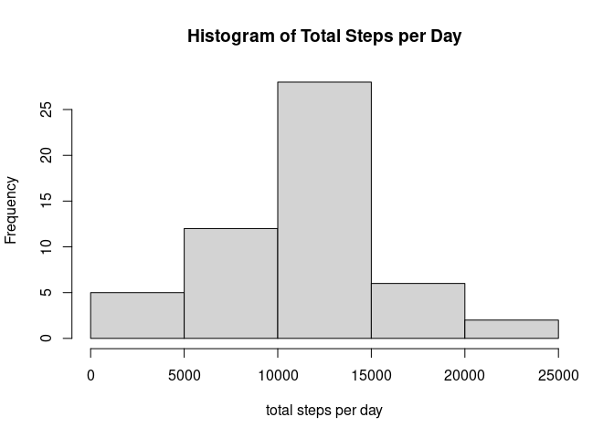
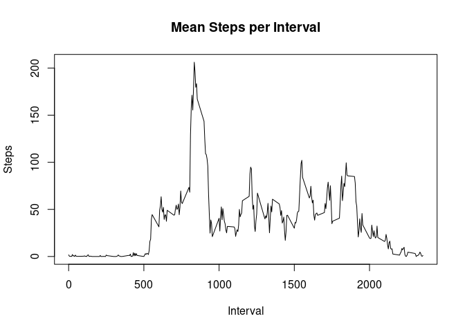
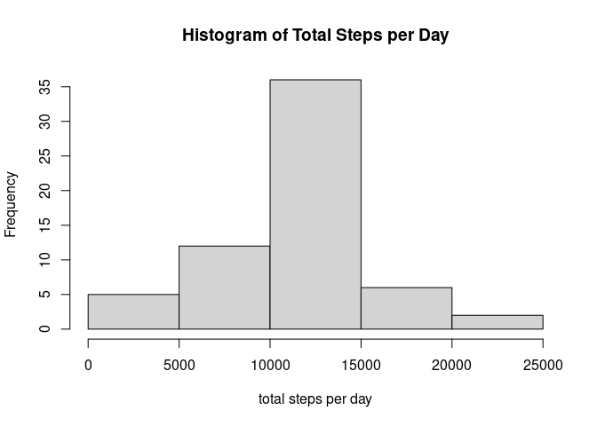
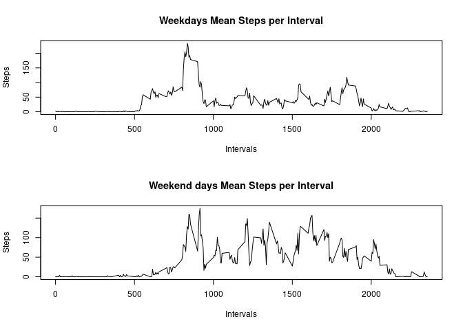

## Loading and preprocessing the data
We read the activity.csv file into data object.

```r
if(!file.exists("./data")) {dir.create(file.path("./", "data"), showWarnings = FALSE)}
unzip("./activity.zip",exdir="./data")
data<-read.csv("./data/activity.csv")
```


We set the date field as date format

```r
data$date<-as.Date(data$date)
```
## What is mean total number of steps taken per day?
### 1. Make a histogram of the total number of steps taken each day


```r
library(dplyr)
```

```
## 
## Attaching package: 'dplyr'
```

```
## The following objects are masked from 'package:stats':
## 
##     filter, lag
```

```
## The following objects are masked from 'package:base':
## 
##     intersect, setdiff, setequal, union
```

```r
filteredData<-filter(data,!is.na(steps))
totalStepsPerDay<-tapply(filteredData$steps,filteredData$date,sum)
hist(totalStepsPerDay, main="Histogram of Total Steps per Day",xlab="total steps per day")
```

<!-- -->
     
### 2. Calculate and report the mean and median total number of steps taken per day
The **mean** of total steps per day is:

```r
mean(totalStepsPerDay)
```

```
## [1] 10766.19
```
The **median** of total steps per day is:

```r
median(totalStepsPerDay)
```

```
## [1] 10765
```

## What is the average daily activity pattern?
### 1. Make a time series plot (i.e. type = "l") of the 5-minute interval (x-axis) and the average number of steps taken, averaged across all days (y-axis)
We obtain the mean steps per Interval and plot them in a Time Series

```r
meanStepsPerInterval<-tapply(filteredData$steps,filteredData$interval,mean)
plot(names(meanStepsPerInterval),
     meanStepsPerInterval,
     type="l",
     main="Mean Steps per Interval",
     xlab="Interval",
     ylab="Steps")
```

<!-- -->
  
### 2. Which 5-minute interval, on average across all the days in the dataset, contains the maximum number of steps?
The interval for the max value is:

```r
library(data.table)
```

```
## 
## Attaching package: 'data.table'
```

```
## The following objects are masked from 'package:dplyr':
## 
##     between, first, last
```

```r
DT<-data.table(names(meanStepsPerInterval),meanStepsPerInterval)
names(DT)<-c("interval","meanSteps")
filter(DT,meanSteps==max(DT$meanSteps))
```

```
##    interval      meanSteps
## 1:      835 <multi-column>
```


## Imputing missing values
### 1. Calculate and report the total number of missing values in the dataset (i.e. the total number of rows with NAs)

```r
print(paste("there are NA in steps?",anyNA(data$steps)))
```

```
## [1] "there are NA in steps? TRUE"
```

```r
print(paste("there are NA in date?",anyNA(data$date)))
```

```
## [1] "there are NA in date? FALSE"
```

```r
print(paste("there are NA in interval?",anyNA(data$interval)))
```

```
## [1] "there are NA in interval? FALSE"
```

```r
print(paste("the total rows with NA are:" ,sum(is.na(data$steps))))
```

```
## [1] "the total rows with NA are: 2304"
```
  
### 2. Devise a strategy for filling in all of the missing values in the dataset. The strategy does not need to be sophisticated. For example, you could use the mean/median for that day, or the mean for that 5-minute interval, etc.
we check if the NA follow a pattern

```r
table(is.na(data$step),data$date)
```

```
##        
##         2012-10-01 2012-10-02 2012-10-03 2012-10-04 2012-10-05 2012-10-06
##   FALSE          0        288        288        288        288        288
##   TRUE         288          0          0          0          0          0
##        
##         2012-10-07 2012-10-08 2012-10-09 2012-10-10 2012-10-11 2012-10-12
##   FALSE        288          0        288        288        288        288
##   TRUE           0        288          0          0          0          0
##        
##         2012-10-13 2012-10-14 2012-10-15 2012-10-16 2012-10-17 2012-10-18
##   FALSE        288        288        288        288        288        288
##   TRUE           0          0          0          0          0          0
##        
##         2012-10-19 2012-10-20 2012-10-21 2012-10-22 2012-10-23 2012-10-24
##   FALSE        288        288        288        288        288        288
##   TRUE           0          0          0          0          0          0
##        
##         2012-10-25 2012-10-26 2012-10-27 2012-10-28 2012-10-29 2012-10-30
##   FALSE        288        288        288        288        288        288
##   TRUE           0          0          0          0          0          0
##        
##         2012-10-31 2012-11-01 2012-11-02 2012-11-03 2012-11-04 2012-11-05
##   FALSE        288          0        288        288          0        288
##   TRUE           0        288          0          0        288          0
##        
##         2012-11-06 2012-11-07 2012-11-08 2012-11-09 2012-11-10 2012-11-11
##   FALSE        288        288        288          0          0        288
##   TRUE           0          0          0        288        288          0
##        
##         2012-11-12 2012-11-13 2012-11-14 2012-11-15 2012-11-16 2012-11-17
##   FALSE        288        288          0        288        288        288
##   TRUE           0          0        288          0          0          0
##        
##         2012-11-18 2012-11-19 2012-11-20 2012-11-21 2012-11-22 2012-11-23
##   FALSE        288        288        288        288        288        288
##   TRUE           0          0          0          0          0          0
##        
##         2012-11-24 2012-11-25 2012-11-26 2012-11-27 2012-11-28 2012-11-29
##   FALSE        288        288        288        288        288        288
##   TRUE           0          0          0          0          0          0
##        
##         2012-11-30
##   FALSE          0
##   TRUE         288
```
We can see that when there are NA in a day appear NA in that day for all intervals.  
We also have seen that it happens in weekdays and in weekends.    
I consider that in a real scenario we should consider if it is important to consider if it is a weekday or a weekend to fill the results. It may impact our results.  
In this case I will take it into account, and I will use the mean of intervals on the same type of days, for that reason we apply here the setting of if a day is weekday or weekend. **Take note that this piece of code would be repeated in section 5 to avoid confusion**  

```r
library(lubridate)
```

```
## 
## Attaching package: 'lubridate'
```

```
## The following objects are masked from 'package:data.table':
## 
##     hour, isoweek, mday, minute, month, quarter, second, wday, week,
##     yday, year
```

```
## The following objects are masked from 'package:base':
## 
##     date, intersect, setdiff, union
```

```r
data$dayType<-lubridate::wday(data$date) %in% c(1, 7)
data$dayType<-factor(data$dayType,c(TRUE,FALSE),c("weekend","weekday"))
```


  
### 3. Create a new dataset that is equal to the original dataset but with the missing data filled in.

```r
filledData<-data

weekendDays<-filter(data,data$dayType=="weekend")
meanIntervalsWeekend<-tapply(weekendDays$interval,weekendDays$steps,mean)
weekdays<-filter(data,data$dayType=="weekdays")
meanIntervalsWeekdays<-tapply(weekdays$interval,weekdays$steps,mean)

naFilter<-is.na(data[,"steps"])
weekendFilter<-data[,"dayType"]=="weekend"

for(i in unique(data$interval)){
        intervalFilter <- data[,"interval"]==i
        newValue<-mean(data[(!naFilter)&weekendFilter&intervalFilter,"steps"])
        filledData[ naFilter&weekendFilter&intervalFilter,"steps"]<-newValue
        newValue<-mean(data[(!naFilter)&(!weekendFilter)&intervalFilter,"steps"])
        filledData[ naFilter&(!weekendFilter)&intervalFilter,"steps"]<-newValue
}

print(paste("the total rows with NA in Filled Data are:" ,sum(is.na(filledData$steps))))
```

```
## [1] "the total rows with NA in Filled Data are: 0"
```
  
### 4. Make a histogram of the total number of steps taken each day and Calculate and report the mean and median total number of steps taken per day. Do these values differ from the estimates from the first part of the assignment? What is the impact of imputing missing data on the estimates of the total daily number of steps?

```r
totalStepsPerDay<-tapply(filledData$steps,filledData$date,sum)
hist(totalStepsPerDay, main="Histogram of Total Steps per Day",xlab="total steps per day")
```

<!-- -->
   
As we could expect the histogram has changed, due that now he have more enties, so the frequency changed in some bars

The **mean** of total steps per day is:

```r
mean(totalStepsPerDay)
```

```
## [1] 10762.05
```
The **median** of total steps per day is:

```r
median(totalStepsPerDay)
```

```
## [1] 10571
```

The median and the mean values had changed lighlty

## Are there differences in activity patterns between weekdays and weekends?
### 1.Create a new factor variable in the dataset with two levels – “weekday” and “weekend” indicating whether a given date is a weekday or weekend day.

**Take note that this piece of code is repeated from section 2** It has been repited due this question should be addressed here, but we also needed it for our strategy to fill the empty data

```r
library(lubridate)
filledData$dayType<-lubridate::wday(filledData$date) %in% c(1, 7)
filledData$dayType<-factor(filledData$dayType,c(TRUE,FALSE),c("weekend","weekday"))
```
  
### 2. Make a panel plot containing a time series plot (i.e. type = "l") of the 5-minute interval (x-axis) and the average number of steps taken, averaged across all weekday days or weekend days (y-axis).

```r
weekendsData<-filter(filledData,dayType=="weekend")
meanStepsPerIntervalWeekend<-tapply(weekendsData$steps,weekendsData$interval,mean)
weekdaysData<-filter(filledData,dayType=="weekday")
meanStepsPerIntervalWeekdays<-tapply(weekdaysData$steps,weekdaysData$interval,mean)

par(mfrow=c(2,1),cex=0.75)
plot(names(meanStepsPerIntervalWeekdays),
     meanStepsPerIntervalWeekdays,
     type="l",
     main="Weekdays Mean Steps per Interval",
     xlab="Intervals",
     ylab="Steps")
plot(names(meanStepsPerIntervalWeekend),
     meanStepsPerIntervalWeekend,
     type="l",
     main="Weekend days Mean Steps per Interval",
     xlab="Intervals",
     ylab="Steps")
```

<!-- -->
   
We can observe that a different pattern in this plots, it seems that there in weekend days there are more activity between intervals 
